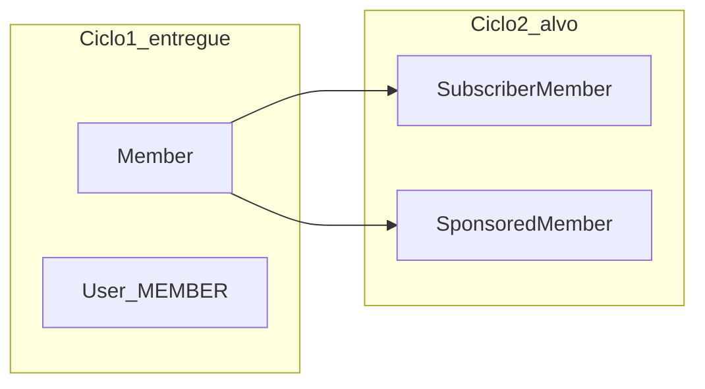

# Plano — Ciclo 2 (Gestão de Membro ADM)

## Contexto e objetivo

O [plano do Ciclo 1](file:///home/carlos/Documents/codes/work/jet/jet-harness/archive/plans/backoffice/fechamento-ciclo-1-membro_27678952.plan.md) deixa **fora do escopo** as “regras completas de mensalidade” e aponta como dependência do Ciclo 2 a base para evoluir **`subscriber_member`**.

Hoje o backend já expõe membro em [`AdminService`](file:///home/carlos/Documents/codes/work/jet/backoffice/src/main/java/backoffice/v1/services/AdminService.java) / [`MemberService`](file:///home/carlos/Documents/codes/work/jet/backoffice/src/main/java/backoffice/v1/services/MemberService.java) e a entidade [`SubscriberMember`](file:///home/carlos/Documents/codes/work/jet/backoffice/src/main/java/backoffice/v1/entities/SubscriberMember.java) existe, mas **não há persistência nem API** para ela. O tipo `SPONSORED` existe em [`MemberTypeEnum`](file:///home/carlos/Documents/codes/work/jet/backoffice/src/main/java/backoffice/v1/entities/enums/MemberTypeEnum.java), porém [`SponsoredMember`](file:///home/carlos/Documents/codes/work/jet/backoffice/src/main/java/backoffice/v1/entities/SponsoredMember.java) também está só no modelo de dados.

## Escopo funcional (Ciclo 2)

### A) Mensalidade — assinante (`SUBSCRIBER`)

- **Criação transacional**: ao criar membro com `member.type = SUBSCRIBER`, criar também **`SubscriberMember`** ligado ao `Member` (mesma transação que `User` + `Member` em [`AdminService.createUser`](file:///home/carlos/Documents/codes/work/jet/backoffice/src/main/java/backoffice/v1/services/AdminService.java) / [`AdminService.createMember`](file:///home/carlos/Documents/codes/work/jet/backoffice/src/main/java/backoffice/v1/services/AdminService.java)).
- **Contrato de entrada** (proposta): estender [`MemberDataCreateDTO`](file:///home/carlos/Documents/codes/work/jet/backoffice/src/main/java/backoffice/v1/dtos/member/MemberDataCreateDTO.java) com bloco opcional validado por Bean Validation, por exemplo `subscriber` com:
  - `monthlyFeeAmount` (BigDecimal, &gt; 0)
  - `billingDay` (1–28 ou 1–31 — **definir regra única** na implementação e documentar no OpenAPI)
  - opcional: `nextDueDate` inicial ou **calcular** a partir do `billingDay` + “hoje” (regra explícita no service)
  - `status` inicial: default `ACTIVE` ou `DUE_SOON` conforme regra de negócio acordada
- **Leitura**: enriquecer [`MemberDTO`](file:///home/carlos/Documents/codes/work/jet/backoffice/src/main/java/backoffice/v1/dtos/member/MemberDTO.java) com um sub-DTO opcional (ex.: `subscriber`) para listagem e detalhe, mapeado em [`MemberMapper`](file:///home/carlos/Documents/codes/work/jet/backoffice/src/main/java/backoffice/common/mappers/MemberMapper.java) via fetch/join ou consulta complementar (evitar N+1 na listagem).
- **Atualização mínima (MVP Ciclo 2)**: endpoint `PATCH` ou `PUT` administrativo para ajustar valor, dia de cobrança e/ou `nextDueDate` / `status` do assinante (escopo fechado; sem motor de cobrança real).

### B) Patrocinado (`SPONSORED`)

- **Regra mínima**: ao criar `SPONSORED`, exigir referência ao patrocinador que concede (ex.: `grantedByUserId` validado como usuário `SPONSOR` ou `SPONSOR_MEMBER` existente) e persistir [`SponsoredMember`](file:///home/carlos/Documents/codes/work/jet/backoffice/src/main/java/backoffice/v1/entities/SponsoredMember.java) com `startAt`, `isActive` default true.
- **Leitura**: incluir resumo no `MemberDTO` (ex.: `sponsored` com `grantedByUserId`, datas) para o detalhe na UI.

### C) Hardening herdado do Ciclo 1 (obrigatório no Ciclo 2)

- **Mensagens**: substituir string literal em [`AdminService.validateTypeRequirements`](file:///home/carlos/Documents/codes/work/jet/backoffice/src/main/java/backoffice/v1/services/AdminService.java) (`"Dados do membro são obrigatórios..."`) por entrada em [`MessageErrorEnum`](file:///home/carlos/Documents/codes/work/jet/backoffice/src/main/java/backoffice/common/exceptions/MessageErrorEnum.java) e reutilizar nos fluxos de validação de `SUBSCRIBER`/`SPONSORED`.
- **Contrato JSON**: alinhar [`backoffice-front/src/types/member.ts`](file:///home/carlos/Documents/codes/work/jet/backoffice-front/src/types/member.ts) (`active`) com o que o Jackson realmente serializa de `isActive` em `MemberDTO` (usar `@JsonProperty("active")` no DTO Java **ou** padronizar `isActive` no front e mapear em [`member-api.ts`](file:///home/carlos/Documents/codes/work/jet/backoffice-front/src/api/member-api.ts)).
- **Testes backend** em [`AdminResourceMemberTest`](file:///home/carlos/Documents/codes/work/jet/backoffice/src/test/java/backoffice/v1/resources/AdminResourceMemberTest.java) (e/ou classes dedicadas): 400 payload inválido, enum inválido, 404 `GET /member/{id}`, asserts de `totalElements`/`currentPage`/`pageSize` na listagem, cenários de criação `SUBSCRIBER` com/sem dados de mensalidade inválidos, `SPONSORED` com grant inválido.
- **Testes frontend**: cobrir erro em query/mutation, filtro `isActive` na listagem, fluxo de cadastro com bloco assinante/patrocinado, detalhe exibindo sub-DTOs — seguindo o padrão de [`benefit-list-page.test.tsx`](file:///home/carlos/Documents/codes/work/jet/backoffice-front/src/pages/benefit/benefit-list-page.test.tsx) / [`use-activate-deactivate-user-mutations.test.tsx`](file:///home/carlos/Documents/codes/work/jet/backoffice-front/src/hooks/use-activate-deactivate-user-mutations.test.tsx).

### D) Documentação de API

- Atualizar anotações em [`AdminApi`](file:///home/carlos/Documents/codes/work/jet/backoffice/src/main/java/backoffice/v1/openapi/api/AdminApi.java) para os novos campos e endpoints de atualização de assinatura/patrocínio.

## Fora do escopo (mantém alinhamento com Ciclo 1)

- Histórico de check-ins e ações amplas de inativar/reativar membro (**Ciclo 3** no documento original).
- Motor financeiro completo (gateway, boletos, retries) — apenas domínio e API administrativa no Ciclo 2.
- “Hardening/regressão completa do módulo” (**Ciclo 4** no documento).

## Critérios de pronto do Ciclo 2

- Criar membro **SUBSCRIBER** persiste `SubscriberMember` consistente e retorna dados de mensalidade na leitura.
- Criar membro **SPONSORED** persiste `SponsoredMember` com vínculo válido ao concedente.
- Listagem/detalhe expõem os novos blocos de dados de forma estável (sem N+1 inaceitável).
- Erros de validação usam `MessageErrorEnum` onde couber; respostas mantêm envelope [`ResponseModel`](file:///home/carlos/Documents/codes/work/jet/backoffice/src/main/java/backoffice/common/requests/ResponseModel.java).
- Testes backend + frontend do ciclo passam; `pnpm build` e suíte Maven relevante verdes.

## Ordem de execução sugerida

1. Fechar regras de domínio (valores default, intervalo de `billingDay`, cálculo de `nextDueDate`, estados iniciais).
2. Backend: repositórios/serviços `SubscriberMember` / `SponsoredMember`, extensão de DTOs e `MemberMapper`, ajuste transacional em `AdminService` / `MemberService`.
3. API + OpenAPI + testes de integração.
4. Frontend: tipos, formulário condicional, detalhe, filtro `isActive`, testes.
5. Revisão de contrato e checklist de aceite do Ciclo 2.
