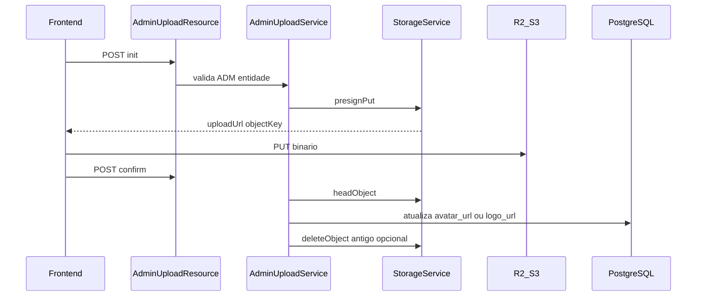

# Plano: Upload de logo e avatar via R2 (signed URL)

## Contexto e alinhamentos

- **Demanda**: [.cursor/tasks/BACKEND_DEMANDAS_UPLOAD_R2.md](.cursor/tasks/BACKEND_DEMANDAS_UPLOAD_R2.md) — init / confirm / delete, sem base64, validação de tipo/tamanho/prefixo, credenciais só no backend.
- **DER** ([docs/backoffice.dbml](docs/backoffice.dbml)): `users.avatar_url`, `sponsors.logo_url` — não há tabela de “metadados de upload”; persistência de vínculo = **atualizar essas colunas** com o path relativo (igual [architecture.mdc](.cursor/rules/architecture.mdc) e business-rule).
- **IDs**: o dbml fala em UUID; o código atual usa `Long` em `[BaseEntity](src/main/java/backoffice/v1/entities/BaseEntity.java)`. Os DTOs devem usar `**Long entityId`** para bater com `User.id` / `Sponsor.id`.
- **Paths da API**: o projeto usa `@Path("/v1/admin")` em `[AdminApi](src/main/java/backoffice/v1/openapi/api/AdminApi.java)`. Os endpoints ficam em `**/v1/admin/uploads/init`**, `**/v1/admin/uploads/confirm`**, `**DELETE /v1/admin/uploads**` (corpo JSON), não em `/admin/...` puro da demanda — mesmo padrão do restante da API.
- **Resposta `publicUrl`**: pode ser montada no backend como `cdnBaseUrl + "/" + objectKey` para o front; o **banco continua só com o path** (regra explícita do projeto).

## 1. Dependências e configuração

- **Maven** ([pom.xml](pom.xml)): adicionar AWS SDK v2 para S3, por exemplo `software.amazon.awssdk:s3` e cliente HTTP (`url-connection-client` ou equivalente usado no projeto). Motivo: endpoint customizado e path-style são o padrão para **R2**; evita acoplar a extensão Quarkus Amazon se a config ficar rígida para AWS.
- **Properties** (ex.: [application.properties](src/main/resources/application.properties) + overrides por perfil `%prod`):
  - Endpoint R2 (`https://<account_id>.r2.cloudflarestorage.com`), região `auto`, access key, secret key, **nome do bucket** (um bucket único é o cenário mais simples).
  - `**storage.cdn.public-base-url`**: base pública (Cloudflare CDN) **sem** barra final — usada só na resposta da API.
  - `**storage.upload.max-bytes`** (ex.: 5MB), `**storage.upload.sign-ttl-seconds`** (ex.: 300).
  - **Prefixo lógico por ambiente** alinhado à tabela de buckets do architecture (ex.: `dev/users/avatar`, `dev/sponsor/logo` vs `prod/...`), de forma que a `objectKey` gravada no banco seja sempre relativa ao bucket e reproduza a convenção documentada.

**Segurança**: não commitar secrets; documentar variáveis esperadas apenas na resposta ao time (sem arquivo `.md` novo no repo, conforme regras do workspace).

## 2. Camada `common` — `StorageService`

- Criar `[backoffice.common.services.StorageService](src/main/java/backoffice/common/services/)` (`@ApplicationScoped`):
  - Cliente S3 configurado com `endpointOverride`, **path-style access** (`true`), credenciais via `@ConfigProperty`.
  - `presignPut(String key, String contentType, Duration ttl)` → URL assinada para **PUT**.
  - `objectExists(String key)` (ex.: `HeadObject`) para o confirm.
  - `deleteObject(String key)` para delete e para remoção do arquivo antigo após troca.
  - Utilitário interno: `**assertKeyMatchesAllowedPrefix(entity, entityId, key)`** — nunca confiar na chave do cliente no init; no confirm/delete apenas validar que a chave bate com o prefixo esperado para aquele `entity` + `entityId`.

Geração de chave no **init** (servidor): algo equivalente à demanda, adaptado aos prefixos Jet, por exemplo:

- Avatar: `{prefix}/users/avatar/{userId}/{yyyy}/{MM}/{epoch}_{random}.{ext}`
- Logo: `{prefix}/sponsor/logo/{sponsorId}/{yyyy}/{MM}/{epoch}_{random}.{ext}`

Extensão derivada de `contentType` (mapa fixo png/jpeg/webp), **não** do `fileName` cru (sanitização mínima: ignorar nome, só validar tamanho do campo se existir).

## 3. Camada `v1` — contrato, resource e service

- **Regra arquitetural**: novo recurso dedicado — não inflar `[AdminResource](src/main/java/backoffice/v1/resources/AdminResource.java)` / `[AdminService](src/main/java/backoffice/v1/services/AdminService.java)`.
  - Interface `[AdminUploadApi](src/main/java/backoffice/v1/openapi/api/)` com `@Path("/v1/admin/uploads")`, `@RolesAllowed("ADM")`, OpenAPI (`@Tag`, `@Operation`, `@APIResponses`), espelhando o padrão de `[AdminApi](src/main/java/backoffice/v1/openapi/api/AdminApi.java)`.
  - `[AdminUploadResource](src/main/java/backoffice/v1/resources/AdminUploadResource.java)` implementando a interface: injeta **apenas** `AdminUploadService`.
- **DTOs** em `v1/dtos/upload/` (sem inner classes):
  - Init: `entity` (enum alinhado à demanda — valores JSON `user` | `sponsor` via `@JsonProperty` ou equivalente), `entityId`, `fileName` (opcional/informativo), `contentType`, `size`.
  - Confirm / Delete: `entity`, `entityId`, `objectKey`.
  - Respostas: campos da demanda (`objectKey`, `uploadUrl`, `publicUrl`, `expiresIn`; confirm com `id` = **id da entidade de domínio** `entityId` para satisfazer o contrato sem nova tabela, documentando no OpenAPI).
- `**AdminUploadService`** (`@ApplicationScoped`):
  - **init**: validar tipo MIME permitido e tamanho; resolver entidade (`User` / `Sponsor`) via `[UserRepository](src/main/java/backoffice/v1/repositories/UserRepository.java)` / `[SponsorRepository](src/main/java/backoffice/v1/repositories/SponsorRepository.java)`; gerar key; chamar `StorageService.presignPut`; montar `publicUrl`.
  - **confirm**: checar prefixo; `HeadObject`; `@Transactional` atualizar `avatarUrl` / `logoUrl` com **somente** `objectKey`; se havia path anterior e é diferente, **apagar objeto antigo** no R2 após commit bem-sucedido (estratégia síncrona simples).
  - **delete**: idempotente — se `objectKey` coincide com o campo atual, zera campo e remove objeto; se já vazio ou key diferente, definir comportamento seguro (ex.: 400 ou no-op documentado).
- **Erros**: estender `[MessageErrorEnum](src/main/java/backoffice/common/exceptions/MessageErrorEnum.java)` para mensagens de upload/storage; usar `[BusinessException](src/main/java/backoffice/common/exceptions/customs/BusinessException.java)` com **413** (tamanho), **415** (content-type), **404** (objeto inexistente no bucket), etc., aproveitando o `[GlobalExceptionMapper](src/main/java/backoffice/common/exceptions/GlobalExceptionMapper.java)` existente.

## 4. Autorização e observabilidade

- **Autorização**: `@RolesAllowed("ADM")` cobre o caso admin da demanda. Validação de negócio: `entityId` deve existir; para `sponsor`, garantir que o patrocinador existe (e, se quiser endurecer depois, que está ativo — não obrigatório para só trocar logo).
- **Logs**: injetar `JsonWebToken` (claim `id` já emitido em `[TokenUtils](src/main/java/backoffice/common/utils/TokenUtils.java)`) e registrar `userId`, `entity`, `entityId`, e `objectKey` onde fizer sentido; `requestId` se disponível via contexto HTTP do Quarkus/Vert.x (MDC), senão omitir ou usar trace id quando habilitado.

## 5. Requisitos não funcionais da demanda

- **Rate limit** (init/confirm): não há padrão pronto no trecho atual do projeto — opções: dependência leve (ex. Bucket4j) com limite por usuário JWT, ou filtro HTTP CDI; incluir na implementação um limite configurável simples.
- **Métricas**: contadores opcionais via MicroProfile Metrics nos métodos do service (sucesso/falha) — baixo custo se já houver extensão; caso contrário, deixar como melhoria pós-MVP.

## 6. Testes

- **Unitários**: `StorageService` com S3Client mockado (Mockito) para presign/head/delete.
- **Integração** (`@QuarkusTest`): testar `AdminUploadResource` com `[quarkus-test-security](pom.xml)` (já no projeto) — JWT com role `ADM`; mockar ou substituir `StorageService` via `@Alternative` / QuarkusMock para não chamar R2 real; cenários: init válido, 415/413, confirm com key inválida, delete idempotente.

## Riscos / decisões explícitas

- **Tabela de metadados** da demanda (`mimeType`, `size`, `uploadedBy` em tabela própria): **fora do escopo** enquanto o DER não tiver essa tabela; o aceite “persistir vínculo” fica atendido por `avatar_url` / `logo_url`. Se no futuro precisarem auditoria, aí sim migrar dbml + entidade.
- **DELETE com body**: atende a especificação da task; clientes HTTP devem suportar corpo no DELETE (RESTEasy no Quarkus suporta).

